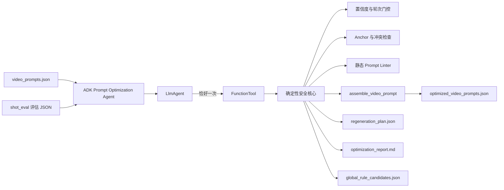

# Prompt Optimization Agent

基于 **Google Agent Development Kit（ADK）2.2.0** 的评估后视频 Prompt 优化 Agent。

它读取 `shot_eval` 产出的评估报告，把已经定位到具体 Prompt 原文的建议安全地应用到
`video_prompts.json`，生成新的 Prompt bundle 和重生成计划。它不会直接生成视频，也不会覆盖原始数据。

## 1. 解决什么问题

视频评估不能只回答“得了多少分”，还需要回答：

1. 问题发生在 `口播 → plan → generated prompt → 视频` 的哪一层；
2. 问题能否通过修改 Prompt 解决；
3. 应该修改哪个字段、哪段原文；
4. Prompt 已经写清楚时，是应该继续修改，还是重试/换模型；
5. 如何保证自动修改不会误用过期、低置信度或未锚定的建议。

Agent 因此将 LLM 编排和确定性修改分开：

- **ADK LlmAgent**：理解用户任务，调用一次优化工具，并总结产物；
- **FunctionTool**：调用确定性优化核心；
- **确定性核心**：执行所有安全校验、应用 patch、重建 Prompt 和写报告。

LLM 不直接修改文件，所有修改必须经过代码门控。

## 2. 整体架构



对应代码：

```text
shot_eval/prompt_optimizer_agent/
├── agent.py       # ADK root_agent + FunctionTool
├── core.py        # 确定性 patch、linter、Prompt 重建和产物生成
├── __main__.py    # Runner + InMemorySessionService CLI
├── __init__.py    # 导出 root_agent 和核心函数
└── README.md
```

## 3. 输入

### 3.1 原始生成 bundle

通常为：

```text
runs/<run>/video_prompts.json
```

Agent 使用其中的：

- `video_prompts[].unit_id`
- `scene_design`
- `visual_beat`
- `effective_style_lock` / `style_lock`
- `duration_seconds`（只原样传给 Prompt 组装函数，不做时长评估）
- `video_prompt`

### 3.2 评估报告

通常为：

```text
runs/<run>/eval/shots-*.json
```

报告需要包含：

```text
optimization.scenes[].scene_id
optimization.scenes[].findings
optimization.scenes[].valid_patches
optimization.scenes[].rejected_patches
optimization.scenes[].non_prompt_actions
```

只有 `valid_patches` 会进入候选集合；`rejected_patches` 永远不会被应用。

## 4. Patch 如何变成优化 Prompt

评估给出的 patch 形如：

```json
{
  "target": "generated_scene_design",
  "op": "replace",
  "anchor": "如蜂群般迅速附着包裹碳水基质",
  "content": "迅速密集地附着包裹碳水基质",
  "reason": "避免科学比喻被生成成真实蜜蜂",
  "confidence": 0.95
}
```

支持四种操作：

| 操作 | 语义 | 约束 |
|---|---|---|
| `replace` | 替换原文 | anchor 必须恰好出现一次，content 非空 |
| `delete` | 删除原文 | anchor 必须恰好出现一次 |
| `insert_after` | 在原文后插入 | anchor 必须恰好出现一次，content 非空 |
| `append` | 追加内容 | content 非空且不能已经存在 |

自动应用后，Agent 不会手写完整 Prompt，而是调用仓库的唯一组装实现：

```text
shot_eval/prompt_assembly.py
└── assemble_video_prompt()
```

因此静音头尾、style lock、Visual beats 和原有 Prompt 结构仍与生成链路一致。

## 5. 自动应用安全门控

默认只有同时满足以下条件的 patch 才会自动应用：

1. 评估报告 `repeats >= 2`；
2. patch 来自 `valid_patches`；
3. `confidence >= 0.8`；
4. target 是：
   - `generated_scene_design`
   - `generated_visual_beat`
5. 操作属于 `replace/delete/insert_after/append`；
6. anchor 在当前 bundle 中仍然逐字存在；
7. replace/delete/insert_after 的 anchor 恰好出现一次；
8. 同字段的多个 patch 不重叠；
9. append 内容尚未存在。

以下目标默认只进入人工复核，不自动应用：

```text
plan_scene_design
plan_visual_beats
style_lock
render_mode
```

原因是这些字段具有 scene 级或全局影响，不能根据单个 shot 的建议直接修改。

### 单轮报告

单轮结果噪声较大，因此默认进入 plan-only 模式：

```text
Would apply: 0
Plan-only mode: True
```

确实需要允许单轮建议时，必须显式传入：

```bash
--allow-single-run
```

不建议在无人复核的生产流程中使用这个开关。

## 6. 根因对应的处理策略

| 根因 | 默认处理 |
|---|---|
| `missing_content` | 补充 generated scene/beat 中缺失的主体、动作或结果 |
| `meaning_drift` | 恢复当前口播/plan 的核心语义 |
| `ambiguous_instruction` | 删除易实体化比喻，改成可观察动作与约束 |
| `conflicting_instruction` | 进入人工复核，消除相互冲突的约束 |
| `overloaded_instruction` | 简化为一个主要动作和一个主要运镜 |
| `unvisualizable_instruction` | 改写为主体、路径、状态变化和最终结果 |
| `scientific_misdescription` | 加入空间边界、相对尺度和连续过程约束 |
| `generator_noncompliance` | Prompt 已明确时优先重试；持续失败再简化或换模型 |

`generator_noncompliance` 不会因为“视频没做到”就不断堆叠同义 Prompt。

## 7. 静态 Prompt Linter

Agent 会对修改前后的 `scene_design` 和 `visual_beat` 做静态检查：

- 科学比喻可能被字面实体化；
- 生理对象可能穿出人体、血管或细胞边界；
- 分子/细胞/器官缺少相对尺度；
- source → path → destination → result 过程不完整；
- 单个 shot 运镜指令过多；
- 精确数字、图表和曲线更适合程序化 MG；
- annotation/label 与 `no text` 冲突。

Linter 只输出 advisory warning：

- 不自动修改 Prompt；
- 不改变评估分数；
- 不修改 `clip_prompt_system.md`；
- 需要人工确认后才能沉淀为全局生成规则。

## 8. 输出文件

默认目录：

```text
runs/<run>/optimizations/<eval-json-stem>/
```

包含：

| 文件 | 作用 |
|---|---|
| `optimized_video_prompts.json` | 已安全应用 patch 的新 bundle |
| `regeneration_plan.json` | 哪些片段需要重生成、重试、复核或跳过 |
| `optimization_report.md` | 人类可读的逐片段修改和 lint 报告 |
| `global_rule_candidates.json` | 跨片段重复根因形成的候选全局规则 |

### 防止新 Prompt 错配旧视频

新 bundle 会强制写入：

```json
{
  "videos": []
}
```

并在 `_optimization_meta.old_videos_invalidated` 中记录原视频映射。

这是为了避免用旧视频评价新 Prompt。原始 `video_prompts.json` 不会被覆盖。

## 9. 安装和鉴权

ADK 版本固定为 2.2.0：

```bash
pip install -r shot_eval/requirements-adk.txt
```

Vertex ADC 鉴权：

```bash
gcloud auth login
gcloud auth application-default login
gcloud auth application-default set-quota-project <your-gcp-project-id>
```

## 10. 使用方式

以下命令均在仓库根目录执行：

```bash
cd shot-eval
```

### 10.1 Dry-run：只预览

不调用 ADK 模型、不写文件、不生成视频：

```bash
python -m shot_eval.prompt_optimizer_agent \
  --run runs/example \
  --eval runs/example/eval/judge-38flash/shots-example-<timestamp>.json \
  --min-confidence 0.8 \
  --dry-run
```

输出会列出：

- 将自动应用的片段数；
- review-only 数量；
- generator retry 数量；
- lint warning 数量；
- 全局规则候选数量。

### 10.2 正式执行 ADK Agent

```bash
python -m shot_eval.prompt_optimizer_agent \
  --run runs/example \
  --eval runs/example/eval/judge-38flash/shots-example-<timestamp>.json \
  --min-confidence 0.8 \
  --agent-model gemini-3.1-pro-preview \
  --project <your-gcp-project-id> \
  --location global
```

正常模式会：

1. 创建 ADK `InMemorySessionService` session；
2. 通过 ADK `Runner` 执行 `root_agent`；
3. `LlmAgent` 恰好调用一次 `FunctionTool`；
4. FunctionTool 执行确定性优化核心；
5. Agent 总结修改数量和产物路径。

代码会校验工具调用次数；不是恰好一次时命令失败。ADK/Vertex 失败也会明确退出，
不会绕过 Agent 静默修改文件。

### 10.3 指定输出目录

```bash
python -m shot_eval.prompt_optimizer_agent \
  --run runs/example \
  --eval runs/example/eval/judge-38flash/shots-example-<timestamp>.json \
  --out /tmp/carbs-prompt-optimization \
  --project <your-gcp-project-id> \
  --location global
```

### 10.4 查看重生成计划

```bash
python - <<'PY'
import json
from pathlib import Path

path = Path(
    "runs/example/optimizations/"
    "shots-example-<timestamp>/regeneration_plan.json"
)
plan = json.loads(path.read_text())
for item in plan["entries"]:
    if item["category"] != "skipped":
        print(item["unit_id"], item["category"])
PY
```

分类含义：

| category | 后续动作 |
|---|---|
| `regenerate_prompt_changed` | Prompt 已改变，人工确认后重生成视频 |
| `retry_generator_noncompliance` | Prompt 已明确，优先换 seed 重试 |
| `review_only` | 涉及全局/plan 字段或不满足安全门控，需要人工检查 |
| `skipped` | 没有稳定且可应用的建议 |

## 11. 当前 carbs_shot 示例

基于三轮稳定报告：

```text
shots-example-<timestamp>.json
```

真实 ADK 运行结果：

```text
ADK tool calls: 1
Applied: 3
Review-only / retry: 2
Skipped: 16
```

自动修改：

- `A03-01`：删除“如蜂群般”，避免酶被生成成蜜蜂；
- `A05-02`：强调发光网络严格位于人体内部；
- `A05-04`：强化葡萄糖密度下降的视觉反差。

建议重试但不继续堆 Prompt：

- `A02-02`：镜头推进和胃壁蠕动未执行；
- `A05-03`：单波峰/回落曲线未执行。

示例产物：

```text
runs/example/optimizations/
└── shots-example-<timestamp>/
    ├── optimized_video_prompts.json
    ├── regeneration_plan.json
    ├── optimization_report.md
    └── global_rule_candidates.json
```

## 12. 后续重生成与闭环评估

Agent 本身不会重生成视频。建议人工确认 `regeneration_plan.json` 后：

1. 只对 `regenerate_prompt_changed` 的片段重生成；
2. 对 `retry_generator_noncompliance` 先换 seed 重试；
3. 把新视频和新 Prompt 放入新的 run，不能覆盖旧 run；
4. 使用与原报告相同的 judge model、判据版本和口径复评；
5. 只有目标扣分消失且没有新增 major/critical 时才接受修改。

验收应围绕具体问题，而不是只看总分。例如 `A03-01` 的验收条件是：

```text
science_accuracy 不再出现“蜜蜂/昆虫/比喻实体化”扣分
```

## 13. 测试

运行 Agent 和全部 shot_eval 测试：

```bash
python -m unittest shot_eval.tests.test_prompt_optimizer -v
python -m unittest discover -s shot_eval/tests -v
python -m compileall -q shot_eval
```

当前验证覆盖：

- ADK root_agent 与 FunctionTool 类型；
- Runner/Session 接线；
- 单轮安全门控；
- 置信度和 target 门控；
- anchor 过期、空 anchor、重复 anchor；
- patch 重叠冲突；
- append 去重；
- 源 bundle 不覆盖；
- 旧视频映射清空；
- 源码组装函数重建 Prompt；
- linter 和全局规则候选；
- ADK 工具紧凑返回。

## 14. 边界

当前 Agent：

- 不判断评估结论是否科学正确，依赖上游评估和人工复核；
- 不自动应用 plan/style/render 等全局修改；
- 不评价音轨；
- 不把时长作为优化指标；
- 不生成视频；
- 不自动接受 linter 或全局候选规则；
- 不保证单次生成一定改善，仍需重生成并复评形成闭环。
